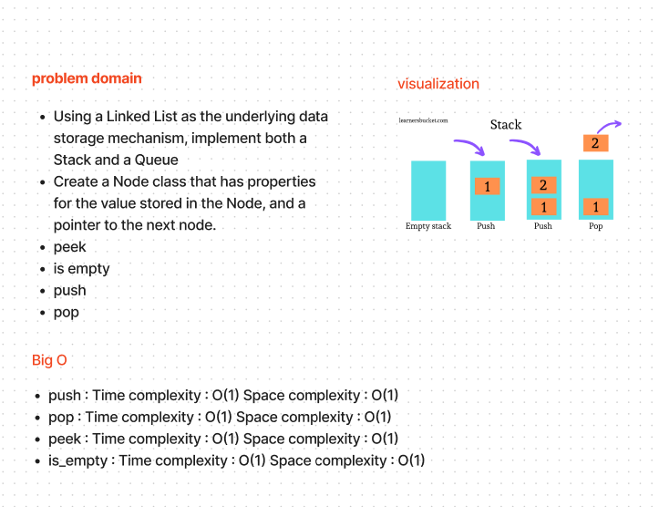
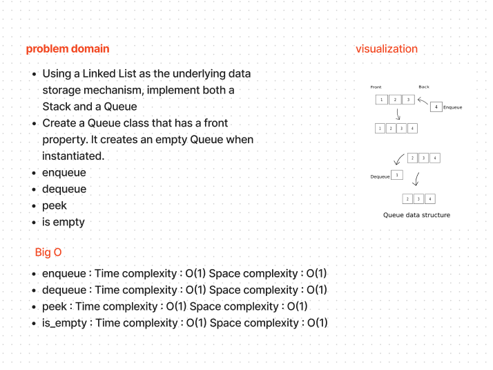

# Stack and Queue

Using a Linked List as the underlying data storage mechanism, implement both a Stack and a Queue

---

## Whiteboard Process

---

## Approach & Efficiency

the big o for this approach will be :

### stack:

- push : Time: O(1) Space: O(1)
- pop : Time: O(1) Space: O(1)
- peek : Time: O(1) Space: O(1)
- is_empty : Time: O(1) Space: O(1)

### Queue:

- enqueue : Time: O(1) Space: O(1)
- dequeue : Time  : O(1) Space: O(1)
- peek : Time: O(1) Space: O(1)
- is_empty : Time: O(1) Space: O(1)

---

## Solution

run the code by:

- python3 -m venv .venv

- source .venv/bin/activate

---

## [code](./stack_and_queue.py)

## [test](./tests/test_stack_and_queue.py)

