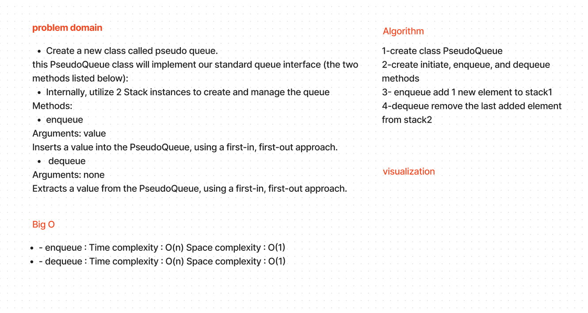

# Stack and Queue pseudo

Create a new class called pseudo queue.

this PseudoQueue class will implement our standard queue interface (the two methods listed below),
Internally, utilize 2 Stack instances to create and manage the queue

Methods:

- enqueue
Arguments: value
Inserts a value into the PseudoQueue, using a first-in, first-out approach.
- dequeue
Arguments: none
Extracts a value from the PseudoQueue, using a first-in, first-out approach.

---

## Whiteboard Process

---

## Approach & Efficiency

the big o for this approach will be :

- enqueue : Time complexity : O(n) Space complexity : O(1)

- dequeue : Time complexity : O(n) Space complexity : O(1)

---

## Solution

run the code by:

- python3 -m venv .venv

- source .venv/bin/activate

---

## [code](./stack_and_queue.py)

## [test](./tests/test_stack_qu_pseudo.py)

